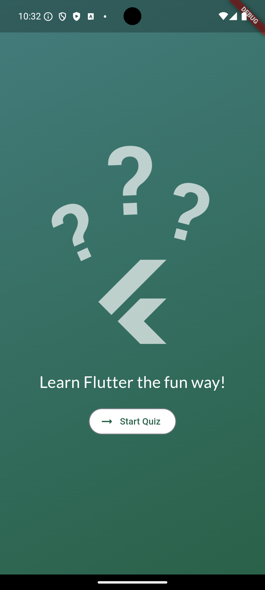
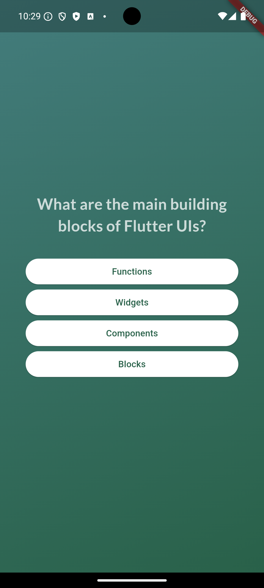
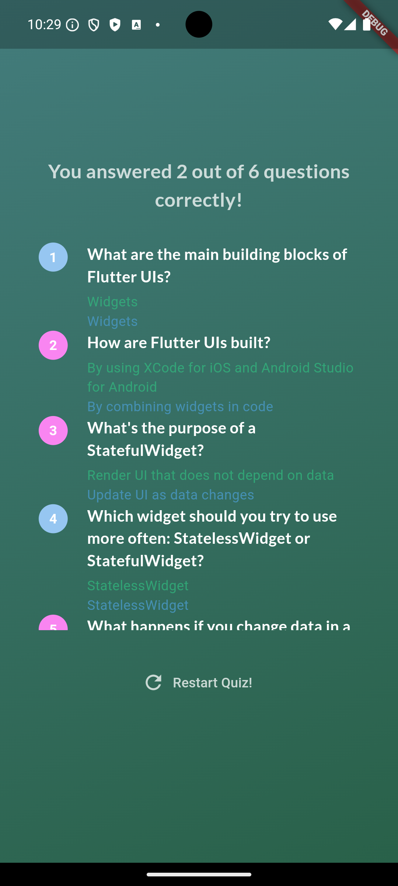

# Quiz App (Quiz Uygulaması)

**Turkish (Türkçe)**

## Proje Açıklaması

Bu Flutter uygulaması, kullanıcıların çeşitli konularda sorularla kendilerini test edebileceği bir quiz uygulamasıdır. Uygulama, farklı kategorilerde sorular sunar ve kullanıcıya anlık geri bildirim sağlar.

## Özellikler

- Farklı kategorilerde sorular
- Doğru/yanlış cevapları anında gösterme
- Kullanıcı puanlama sistemi
- Sonuç ekranı

## Ekran Görüntüleri

Aşağıda uygulamadan bazı ekran görüntülerini bulabilirsiniz:


*Başlangıç Ekranı Görseli*


*Quiz Ekranı Görseli*


*Sonuç Ekranı Görseli*


## Kurulum

1. Kodu bilgisayarınıza indirin:

    ```bash
    git clone https://github.com/YenerCenger/Quiz-App.git
    cd Quiz-App
    ```

2. Gerekli bağımlılıkları yükleyin:

    ```bash
    flutter pub get
    ```

3. Uygulamayı çalıştırın:

    ```bash
    flutter run
    ```

## Dikkat Edilmesi Gerekenler

- Uygulama, farklı konularda sorular sunar ve kullanıcıya anlık geri bildirim sağlar.
- Kullanıcı, her sorunun sonunda doğru cevabı öğrenebilir ve sonuçlarını görebilir.

## Katkıda Bulunma

Eğer bu projeye katkıda bulunmak istiyorsanız, lütfen bir çekme isteği (pull request) açın. Büyük değişiklikler yapmadan önce, lütfen tartışma bölümünde konuyu açın.

## Lisans

Bu proje [MIT Lisansı](LICENSE) altında lisanslanmıştır. Daha fazla bilgi için [LİSANS DOSYASI](LICENSE) dosyasını inceleyin.

---

**English**

## Project Description

This Flutter application is a quiz app where users can test their knowledge on various topics. The app provides questions from different categories and gives immediate feedback to the user.

## Features

- Questions from different categories
- Instant feedback on correct/incorrect answers
- User scoring system
- Results screen

## Screenshots

Below are some screenshots from the app:


*Home screen image*


*Quiz screen image*


*Result screen image*

## Installation

1. Clone the code to your computer:

    ```bash
    git clone https://github.com/YenerCenger/Quiz-App.git
    cd Quiz-App
    ```

2. Install the required dependencies:

    ```bash
    flutter pub get
    ```

3. Run the app:

    ```bash
    flutter run
    ```

## Notes

- The app provides questions on various topics and gives instant feedback to the user.
- Users can see the correct answers and view their results at the end of the quiz.

## Contributing

If you want to contribute to this project, please open a pull request. Before making significant changes, please open a discussion in the Issues section.

## License

This project is licensed under the [MIT License](LICENSE). For more information, see the [LICENSE](LICENSE) file.
